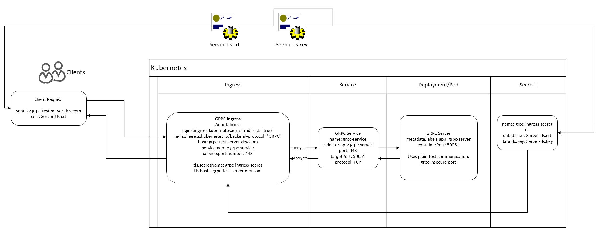
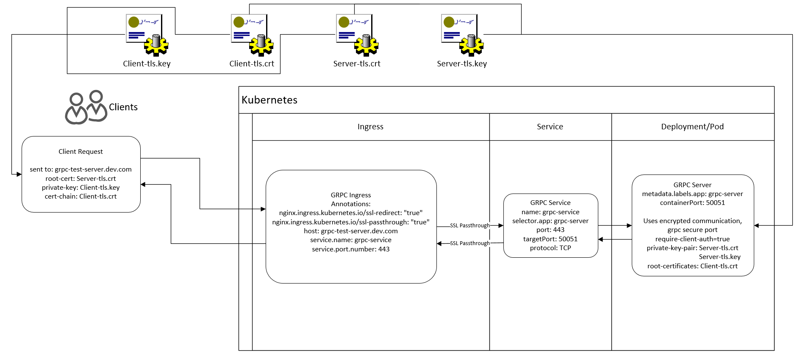
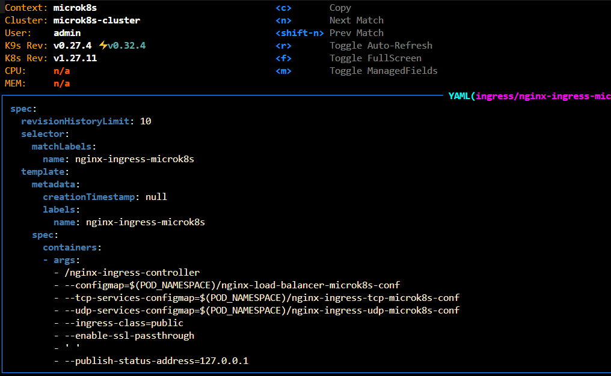
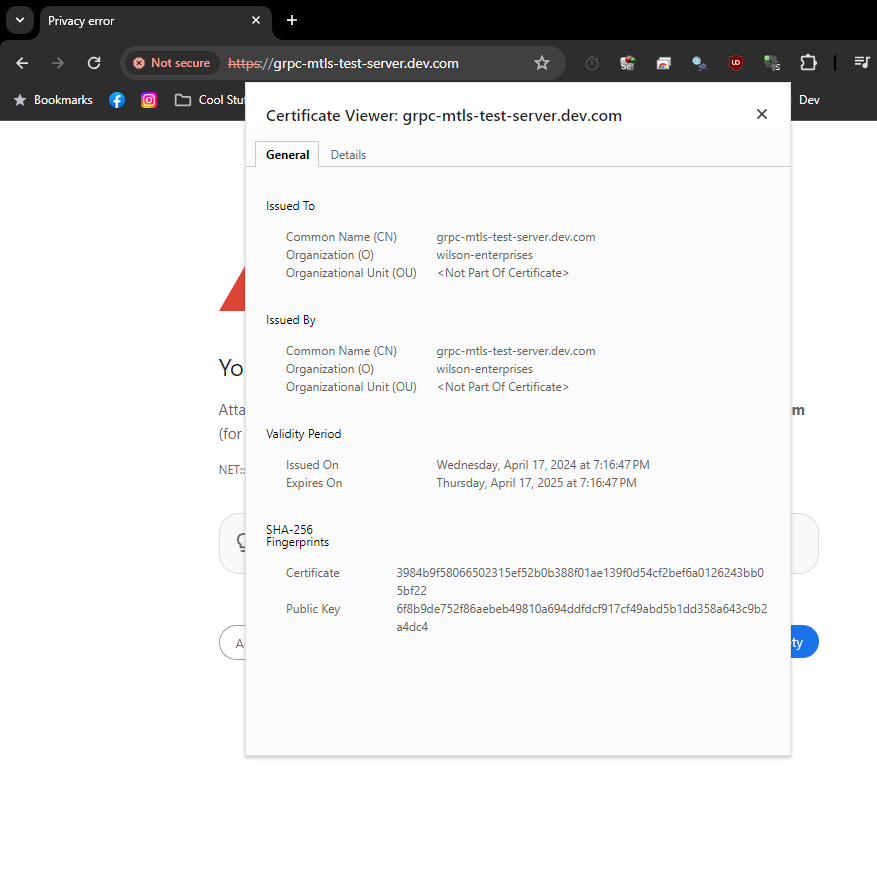
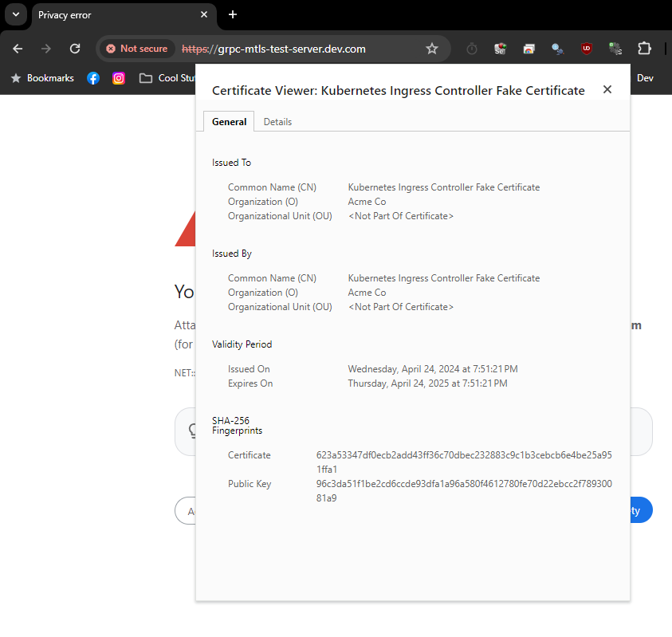

# GRPC test

Table of Contents:
* [GRPC test](#grpc-test)
    * [Diagrams](#diagrams)
        * [GRPC Insecure](#grpc-insecure)
        * [GRPC Secure](#grpc-secure)
    * [TLS Example](#tls-example-grpc_insecure_test)
    * [MTLs Example](#mtls-example-grpc_mtls_test)
        * [Enabling SSL Passthrough](#make-sure-ssl-passthrough-is-enabled-for-your-ingress-controller)
        * [Client Considerations](#client-considerations)
* [GRPC Info](#grpc-info)

---------

Project to test running grpc server in k8s with nginx ingress controller managing incoming traffic.

TLS is required for this to work, port 80 is already reserved for http:1.x traffic so we force a redirect to https and provide a certificate to 'authenticate' with. This same cert is used by the client to 'authenticate' with the server and send requests. I have authenticate in quotes here because calling this security would be doing a great disservice to the readers, anyone with the public key is able to hit the grpc api. Sure they don't have your proto definition so replicating a request might be difficult, but that doesn't change the fact that it's essentially an open api, just with encrypted end to end traffic. Typically when using this type of security, the client would provide a token for authorization and authentication, in this example you will find no such measures, hence my insistence that this is not secure. Read more about grpc auth [here](https://grpc.io/docs/guides/auth/)

To generate a cert:
`openssl req -x509 -sha256 -nodes -days 365 -newkey rsa:2048 -keyout tls.key -out tls.crt -subj "/CN={url}/O={org_name}"`
>Brief explanation, this generates an x509 tls certificate good for 1 year (365 days) where the private key has no password (thanks to the -nodes arg). The certificate will be output as tls.crt and the private key will be output as tls.key. The CN (url) argument should be the url you want the server to operate from and will also be the url (host) you set in your ingress controller. There are other parameters you can add as well to provide more information, org_name was provided in my case but this is not an exhaustive list. See [digicert's quick ref](https://www.digicert.com/kb/ssl-support/openssl-quick-reference-guide.htm) for more info.

To generate a secret from the cert: <br>
`kubectl create secret tls {secret_name} --key {tls_key_file} --cert {tls_cert_file} -n {namespace}`

To generate a secret and save it to a file instead of immedietly uploading to the cluster: <br>
`kubectl create secret tls {secret_name} --key {tls_key_file} --cert {tls_cert_file} -n {namespace} --dry-run=client -o yaml`

And if you want to persist this to a file, you can add `> output_file_name.yaml` to the end of the previous statement

## Diagrams

### GRPC Insecure


### GRPC Secure


## TLS Example (grpc_insecure_test)

Within the `grpc_insecure_test` folder, you'll find an example of how I managed to get tls auth working for a simple hello world application. My setup is a microk8s cluster with nginx ingress controller. The grpc server in this example is configured for plain text communication and the ingress controller handles encrypting outgoing traffic and decrypting incoming traffic. In order to make this work, you'll need a tls cert to provide to the ingress controller and your external client(s) will need to use the public key when sending requests to the ingress endpoint. 
* Internal clients can communicate with the grpc server using the plain text protocol, and the url they access the server at would be as follows: `grpc-server-service-name.namespace.svc.cluster.local` 
* The port would be the inbound service port (port) as opposed to the outbound service port (targetPort)

When using this style of authentication, you need to have an annotation on your ingress controller specifying the backend protocol as grpc and I have the ssl-redirect annotation enabled as well for good measure. See the example below:

```yaml
apiVersion: networking.k8s.io/v1
kind: Ingress
metadata:
  name: ingress-name
  namespace: namespace-name
  annotations:
    nginx.ingress.kubernetes.io/ssl-redirect: "true"
    nginx.ingress.kubernetes.io/backend-protocol: "GRPC"
spec:
  rules:
  - host: endpoint-url.domain.extension
    http:
      paths:
      - path: /
        pathType: Prefix
        backend:
          service:
            name: service-name
            port:
              number: 80 # Use your service port here, doesn't have to be 80
  ingressClassName: nginx
  tls:
  - secretName: grpc-server-tls-secret
    hosts:
      - endpoint-url.domain.extension
```


## MTLs Example (grpc_mtls_test)

Within the `grpc_mtls_test` folder, you'll find an example of how I managed to get mtls working on my local cluster. My setup is a microk8s cluster with nginx ingress controller. There are a lot of github threads out there talking about GRPCs or GRPC MTLs auth and almost all of them claim that you need to use a GRPCs annotation for the nginx backend protocol ie. `nginx.ingress.kubernetes.io/backend-protocol: "GRPCS"`. I struggled to get this working and in the end, this was not necessary. From various github threads on the nginx ingress controller I read that when ssl-passthrough is enabled, nginx simply forwards the traffic through to the service and then to the pod, allowing the pod to handle all ssl. At the level, nginx shouldn't even care whether the endpoint is http/1.1 or http/2, the former being used for unencrypted web traffic (http) and the latter being used for encrypted web traffic and grpc (https/grpc). Technically, http/2 is available over http and https but browsers only support it over https. Now onto the implementation steps:

### Make sure ssl-passthrough is enabled for your ingress controller
* This was the step I was missing initially, when using nginx for ingress it wants to handle the ssl encryption/decryption process so that your internal cluster traffic can be unencrypted. By default, ssl-passthrough is not allowed and if you try to use it with a config similar to the one below, nginx will serve a 'fake' ssl  cert from the ingress controller, preventing your client from directly accessing the pod's ssl endpoint.
* Example ssl-passthrough ingress definition: <br>
    >Notice the lack of tls configuration, ssl-redirect is enabled along with ssl-passthrough
    ```yaml
    apiVersion: networking.k8s.io/v1
    kind: Ingress
    metadata:
    name: ingress-grpc-mtls-test-server
    namespace: grpc-test
    annotations:
        nginx.ingress.kubernetes.io/ssl-redirect: "true"
        nginx.ingress.kubernetes.io/ssl-passthrough: "true"
    spec:
    rules:
    - host: grpc-mtls-test-server.dev.com
        http:
        paths:
        - path: /
            pathType: Prefix
            backend:
            service:
                name: grpc-mtls-test-server-entrypoint
                port:
                number: 443
    ingressClassName: nginx
    ```
* The nginx controller is a daemonset, here you can see how I enabled ssl-passthrough. If you are using microk8s, simply edit the daemonset and add `--enable-ssl-passthrough` to the arg list
    
* Now if we open a web browser and navigate to the nginx endpoint, we can see that our certificate set on our grpc server is being served to the client despite the lack of tls configuration on the ingress controller. Make sure you set the protocol to https when attempting to access the endpoint

* If you don't have ssl passthrough enabled, your client will see the fake certificate being served by your ingress controller rather than your grpc application


### Client considerations

With the server set up and working, now we just need a client. In the inseecure example, any clients internal to the cluster can use a plain text grpc connector because encryption is handled at the ingress level, but with this mtls example all clients will need to have the client certificate because the grpc server itself is handling the encryption/decryption of traffic. 

# GRPC Info

To generate the protobuf python files, use the following command:

`python -m grpc_tools.protoc -I {root_folder} --python_out={py_out} --grpc_python_out={grpc_py_out} {proto_files}`

<b>root_folder</b> = root location of proto files, use . for current directory<br>
<b>py_out</b> = folder to output {service}_pb2.py file, use . for current directory<br>
<b>grpc_py_out</b> = folder to output {service}_pb2_grpc.py file, use . for current directory<br>
<b>proto_files</b> = space separated list of proto file names to generate, if only one file just enter the single file name